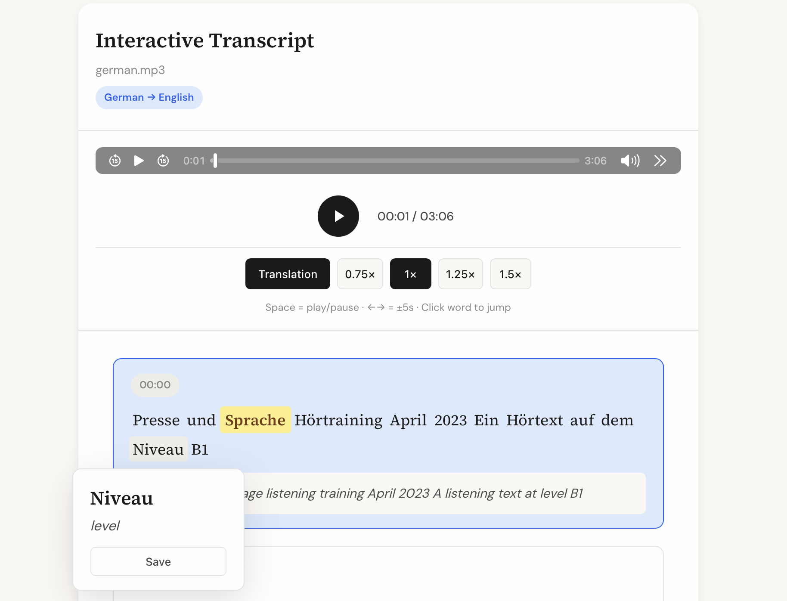

# Multilingual Transcriber

Generate interactive HTML documents from audio, video, or text files with translations and vocabulary tracking.



## Features

- **Multiple input formats** — Audio, video, and text files
- **Word-level timestamps** — Click any word to jump to that point
- **Real-time highlighting** — Words highlight as the media plays
- **Translation** — Automatic translation to 50+ languages
- **Vocabulary builder** — Save words and export to CSV/TXT
- **Lemmatization** — Shows dictionary forms for 25+ languages
- **Offline HTML** — Self-contained files work without internet
- **Mobile-friendly** — Generated HTML files are fully responsive and work on phones/tablets with all functionality preserved

## Supported Formats

| Type  | Extensions                                      |
| ----- | ----------------------------------------------- |
| Audio | mp3, wav, m4a, flac, ogg, wma, aac              |
| Video | mp4, mkv, avi, mov, webm, wmv, flv              |
| Text  | pdf, docx, html, srt, vtt                       |

## Requirements

- Python 3.9+
- FFmpeg

## Installation

### 1. Download the Repository

1. Go to the GitHub repository page
2. Click the green **"Code"** button
3. Select **"Download ZIP"**
4. Extract the ZIP file to a folder of your choice
5. **Rename the extracted folder** from `multilingual-transcriber-main` to `multilingual-transcriber` (remove the `-main` suffix)

### 2. Install FFmpeg

**macOS:**
```bash
brew install ffmpeg
```

**Ubuntu/Debian:**
```bash
sudo apt update && sudo apt install ffmpeg
```

**Windows:**

Option 1 - Using winget (recommended for Windows 10/11):
```powershell
winget install ffmpeg
```

Option 2 - Using Chocolatey:
```powershell
choco install ffmpeg
```

Option 3 - Manual installation (any Windows version):
1. Download FFmpeg from https://ffmpeg.org/download.html
2. Extract the archive
3. Add the `bin` folder to your system PATH

After installation, **restart your terminal/PowerShell** for FFmpeg to be available.

### 3. Install Python Dependencies + Whisper Backend

Open a terminal/PowerShell and navigate to the extracted folder, then run **one** of the following commands based on your hardware:

**Apple Silicon (M1/M2/M3/M4):**
```bash
cd /path/to/multilingual-transcriber
pip install -e .[mlx]
```

**Windows/Linux with NVIDIA GPU:**
```bash
cd /path/to/multilingual-transcriber
pip install -e .[cuda]
```

**CPU fallback (any platform):**
```bash
cd /path/to/multilingual-transcriber
pip install -e .[cpu]
```

> **Note for zsh users (macOS):** If you get an error, use quotes: `pip install -e ".[mlx]"`

### 4. (Optional) Enhanced Finnish Lemmatization with Voikko

Finnish lemmatization works on all platforms via spaCy. However, on macOS and Linux you can optionally install Voikko for improved Finnish lemmatization quality.

**macOS:**
```bash
brew install libvoikko
pip install -e .[mlx,voikko]   # or combine with cuda/cpu instead of mlx
```

**Ubuntu/Debian:**
```bash
sudo apt install libvoikko-dev voikko-fi
pip install -e .[cuda,voikko]   # or combine with cpu instead of cuda
```

You can combine multiple extras with commas, e.g. `pip install -e .[mlx,voikko]`

## Usage

### Running the Transcriber

Navigate to the extracted repository folder and run:

```bash
cd /path/to/multilingual-transcriber
python -m transcriber.main --help
```

You should see the help message with available options.

### Quick Examples

**Audio file:**
```bash
python -m transcriber.main audio_fin.mp3
```

**Video file:**
```bash
python -m transcriber.main video_fin.mp4 -t en
```

**Text file** (source language required):
```bash
python -m transcriber.main text_fin.html -s fi -t en
```

**Process all files in a folder:**
```bash
python -m transcriber.main . -s fi -t en
```

### Options

| Flag               | Description                                    |
| ------------------ | ---------------------------------------------- |
| `-s`, `--source`   | Source language (required for text files)      |
| `-t`, `--target`   | Target language (default: `en`)                |
| `-m`, `--model`    | Whisper model (auto-detected per backend)      |
| `-n`, `--limit`    | Process only N files                           |
| `-f`, `--force`    | Overwrite existing outputs                     |
| `--list-languages` | Show available language codes                  |

### Available Whisper Models

| Size   | Parameters | Multilingual Model | Required VRAM | Relative Speed |
| ------ | ---------- | ------------------ | ------------- | -------------- |
| tiny   | 39 M       | `tiny`             | ~1 GB         | ~10x           |
| base   | 74 M       | `base`             | ~1 GB         | ~7x            |
| small  | 244 M      | `small`            | ~2 GB         | ~4x            |
| medium | 769 M      | `medium`           | ~5 GB         | ~2x            |
| large  | 1550 M     | `large`            | ~10 GB        | 1x             |
| turbo  | 809 M      | `turbo`            | ~6 GB         | ~8x            |

Default is `large-v3-turbo` which offers high quality with fast speed. For absolute best quality, use `large-v3`.

### More Examples

```bash
python -m transcriber.main audio.mp3 -t es            # Transcribe → Spanish
python -m transcriber.main ./folder/ -t en -n 5       # Limit to 5 files
python -m transcriber.main ./folder/ -t en -f         # Force reprocess existing
python -m transcriber.main audio.mp3 -m small         # Use smaller/faster model
python -m transcriber.main audio.mp3 -m large-v3      # Use highest quality model
```

## Mobile Usage

The generated HTML files are fully responsive and optimized for mobile devices. You can:

1. Run the transcriber on your computer
2. Transfer the generated `*_interactive.html` file to your phone (via email, cloud storage, etc.)
3. Open it in any mobile browser

All features work on mobile including audio playback, word highlighting, vocabulary saving, and export.

## Keyboard Shortcuts (in generated HTML)

| Key   | Action           |
| ----- | ---------------- |
| Space | Play/Pause       |
| ←     | Skip back 5s     |
| →     | Skip forward 5s  |
| Esc   | Close panels     |

## Troubleshooting

**First run is very slow?**  
On the first run, the program needs to download:
- The Whisper model (~1.5GB for `large-v3-turbo`)
- The spaCy language model (~50MB)

This can take several minutes depending on your internet connection. Subsequent runs will be much faster as models are cached locally.

**Transcription is slow on CPU?**  
If you don't have a GPU (NVIDIA with CUDA) or Apple Silicon, transcription runs on CPU which is significantly slower. You can use a smaller model for faster results (with reduced quality):
```bash
python -m transcriber.main audio.mp3 -m small
```

**Music sections or silence are skipped/transcribed poorly?**  
The default `large-v3-turbo` model may skip silent or music-only sections. For best accuracy, use the full `large-v3` model:
```bash
python -m transcriber.main audio.mp3 -m large-v3
```

**Stuck after model download?**  
The turbo model can occasionally loop on silence. Use `-m large-v3` instead.

**"Source language required"?**  
Text files need `-s`: `python -m transcriber.main doc.txt -s de -t en`

**spaCy model fails to download?**  
Manual install: `python -m spacy download en_core_web_sm`

**Voikko errors on Windows?**  
This is expected — Voikko is not supported on Windows. The program automatically uses spaCy for Finnish lemmatization instead.

## Repository Structure

```
multilingual-transcriber/
├── setup.py
├── README.md
├── LICENSE
├── audio_fin.mp3                                  # Example Finnish audio
├── video_fin.mp4                                  # Example Finnish video
├── text_fin.html                                  # Example Finnish text
├── assets/
│   └── example.png                                
├── outputs/
│   ├── audio_fin_fi-en_interactive_template.html  # Example output
│   ├── video_fin_fi-en_interactive_template.html  # Example output
│   └── text_fin_fi-en_interactive_template.html   # Example output
└── transcriber/
    ├── __init__.py
    ├── main.py
    ├── core.py
    ├── config.py
    ├── utils.py
    ├── parsers.py
    └── templates.py
```

## Contributing

Found a bug or have a suggestion? Please [open an issue](../../issues) on GitHub!

Contributions are welcome. Feel free to submit a pull request.

## License

This project is licensed under the MIT License - see the [LICENSE](LICENSE) file for details.
